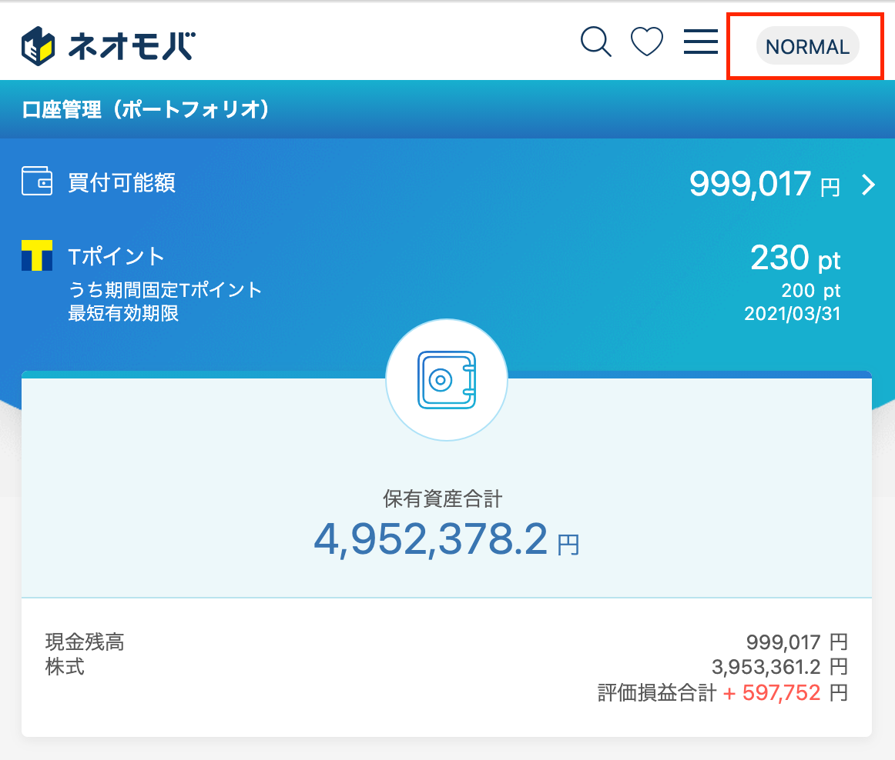
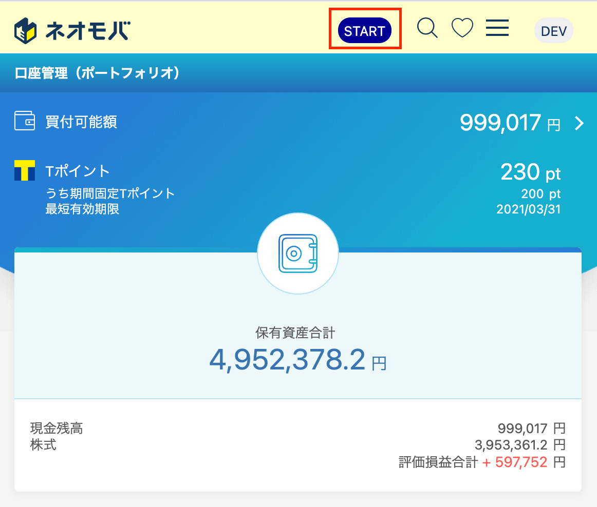
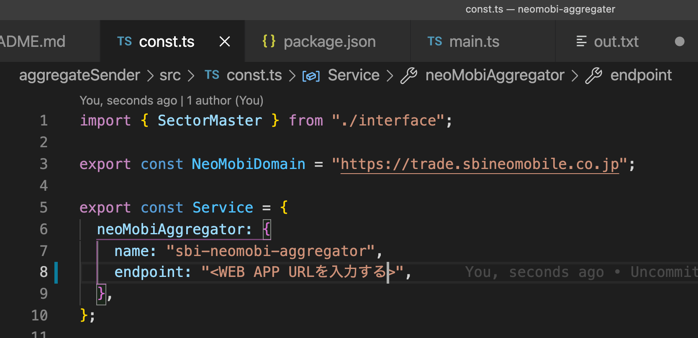
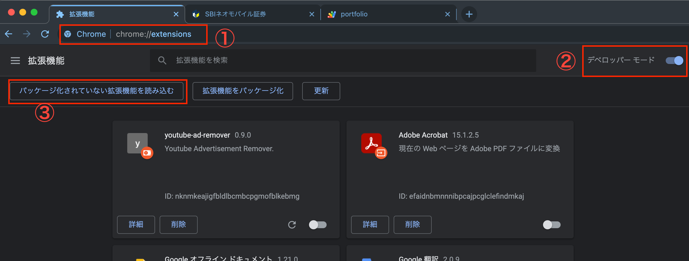
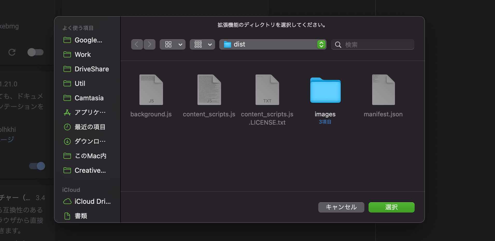
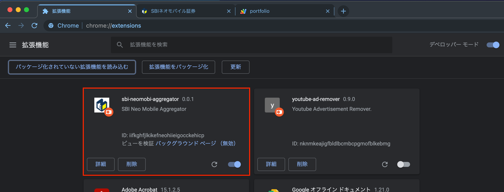

# neomobi-aggregater

SBI ネオモバイル集計スクリプト

## 1. はじめに

SBI ネオモバイル集計スクリプトは SBI ネオモバイルで作成したポートフォリオの情報を集計し、スプレッドシートにまとめるスクリプトです。
リバランス、リアロケーションをする際や株価売買判断の際、
情報を一覧して判断するために作成しました。

## 2. 構成

 本スクリプトは２つのスクリプトで構成されている。

- aggregateSender
  - 技術：Chrome Extensions
  - 説明：SBI ネオモバイルから情報を収集しスプレッドシートに送信します。
- aggregateReceiver
  - Google Apps Script
  - aggregateSender から送られてきた情報を整形し、スプレッドシートに表形式で出力します。

## 3.  使い方

### 3.1. SBI ネオモバイルの[ポートフォリオ画面](https://trade.sbineomobile.co.jp/account/portfolio)にアクセスします

### 3.2. NORMAL ボタンを選択します

NORMAL ボタンを選択すると画面が開発モードに切り替わります。

### 3.3. START ボタンを選択します

START ボタンを選択すると集計が開始されます。

## 4. スクリプトのセットアップ※編集中

あらかじめ本リポジトリを git clone しておきます。
`git clone git@github.com:techreis/neomobi-aggregater.git`

### 4.1 aggregateReceiver のセットアップ

#### 4.1.0 事前準備

#### 4.1.1 aggregateReceiver 直下に移動

`cd /neomobi-aggregater/aggregateReceiver`

#### 4.1.2 ライブラリのインストール

`yarn install`

#### 4.1.3 google clasp ログイン

question npm username: <あなたの  任意のユーザ名>
question npm email: <あなたの gmail>
`yarn login`

#### 4.1.4 Google Apps Script にソースコードをアップロード

`yarn push`

#### 4.1.5 Google アプリケーションデプロイ

`yarn deploy`

#### 4.1.6 アプリケーションの認証

1. ユーザ認証する
   

2. 「許可を確認」を選択する
   

3. 「詳細」を選択する
   

4. 「<プロジェクト名>(安全ではないページ)に移動」を選択する

5. 「許可」を選択する
   

#### 4.1.7 web app URL の値を控えておく

### 4.2. aggregateSender のセットアップ

#### 4.2.1 aggregateSender 直下に移動

`cd /neomobi-aggregater/aggregateSender`

#### 4.2.2 ライブラリのインストール

`yarn install`

#### 4.2.2 ライブラリのインストール

`yarn install`

#### 4.2.3 エンドポイントの編集

4.1.7 で控えておいた web app URL を書きの場所に貼り付ける
`/neomobi-aggregater/aggregateSender/src/const.ts`

#### 4.2.4 Chrome Extensions のビルド

`yarn build`

#### 4.2.5 Chrome Extensions のインポート

1. [chrome://extensions/](chrome://extensions/) を開く
2. デベロッパーモードを ON にする
3. パッケージ化されていない拡張機能を読み込むを選択
   

4. 4.2.4 の結果作成された dist フォルダを選択する
   
5. 下記画像のようになっていれば設定完了
   
