# neomobi-aggregater

ネオモバイルの集計スクリプト

## 1. スプレッドシートの設定

### 1.1:スプレッドシートを開く

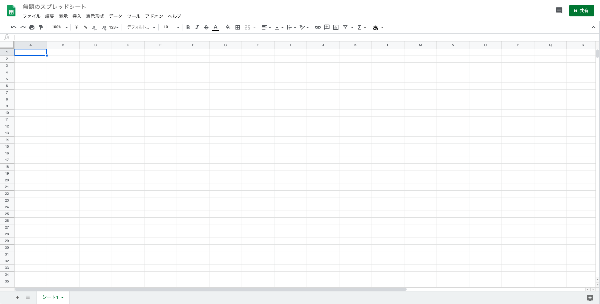

### 1.2:ツール → スクリプトエディタ

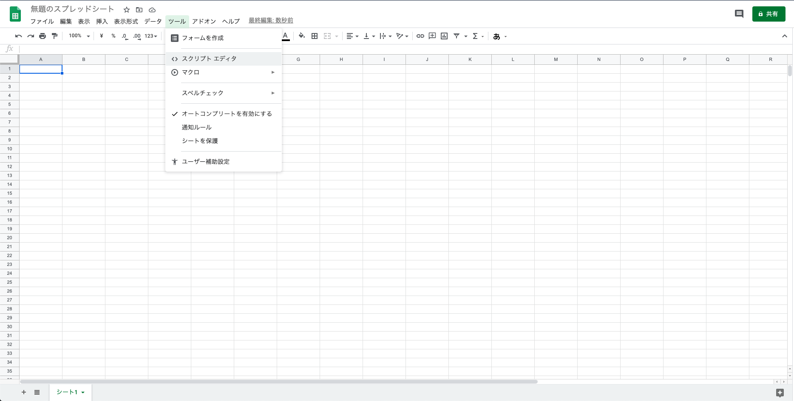

### 1.3:コード.gs ファイルに下記のコードを貼り付ける

[techreis/google-apps-script/app.js](https://github.com/techreis/neomobi-aggregater/blob/master/src/google-apps-script/app.js)

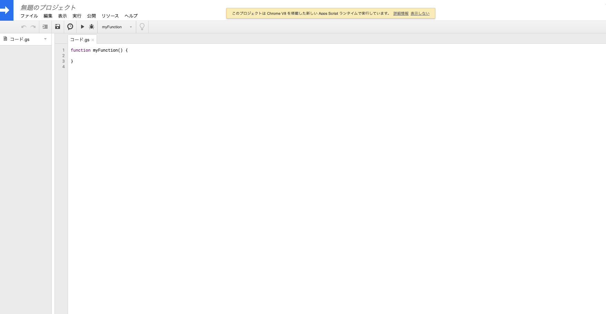

### 1.4:保存する。プロジェクトの名前は適当(例では sample とする)

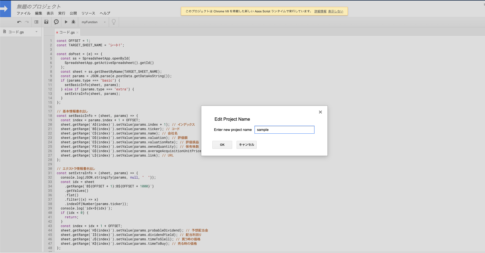

### 1.5:ツール → ウェブアプリケーションとして導入...

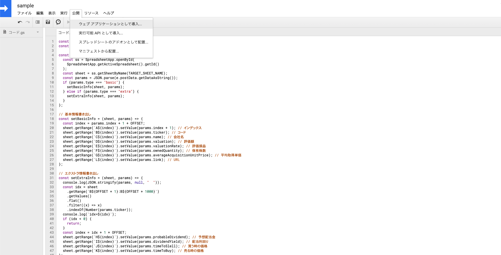

### 1.6:Deploy を押す

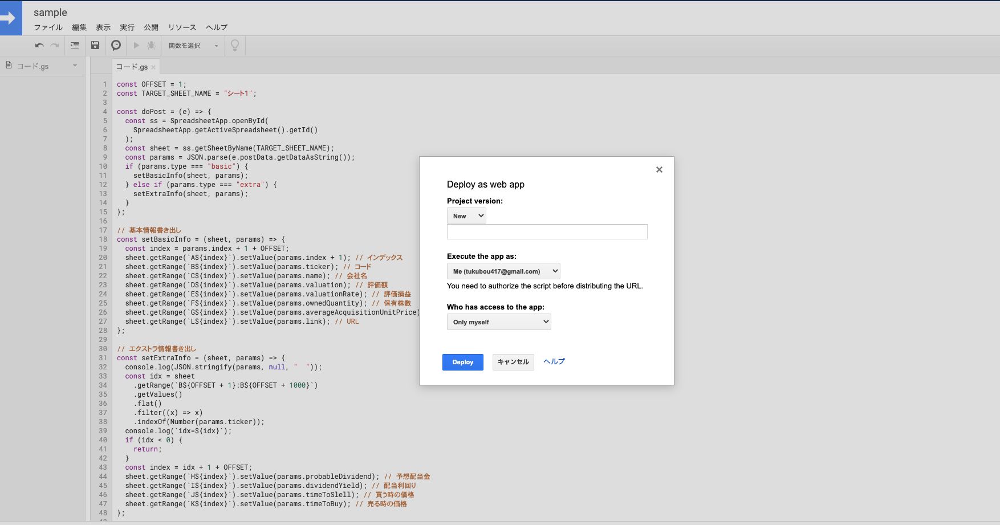

### 1.7:「許可を確認」を選択する

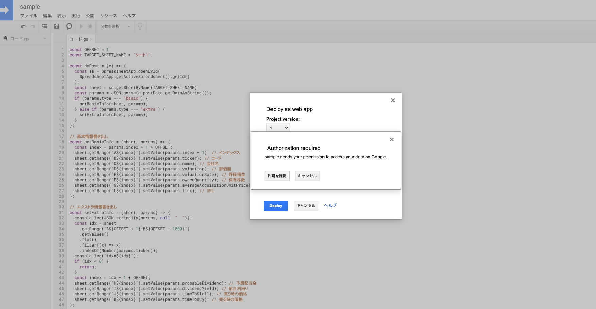

### 1.8:「許可を確認」を選択する

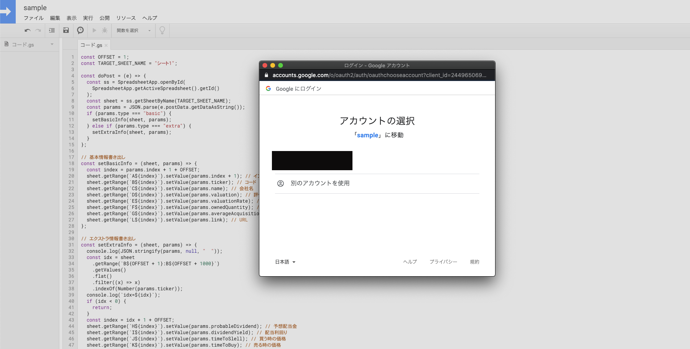

### 1.9:「詳細」を選択する

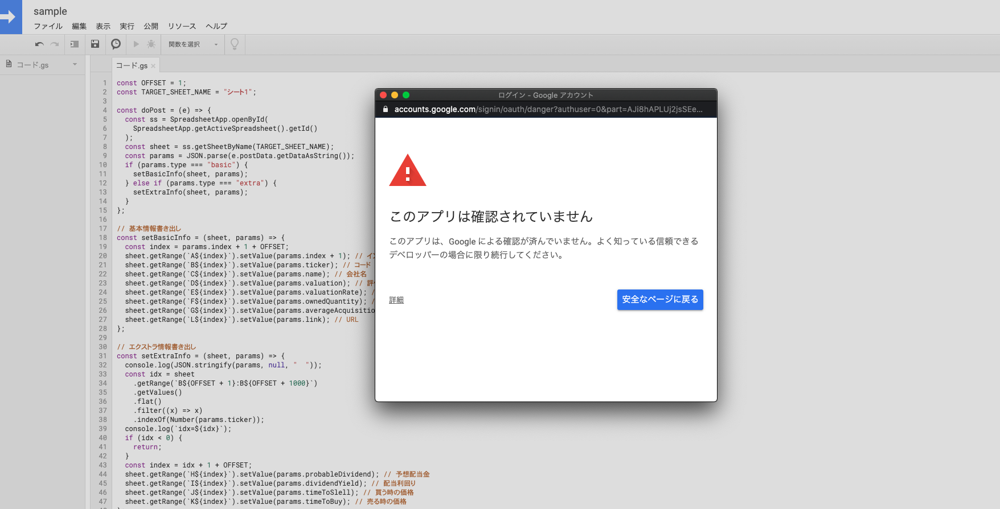

### 1.10:「<プロジェクト名>(安全ではないページ)に移動」を選択する

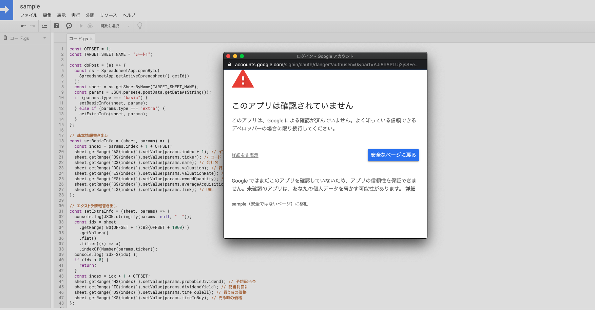

### 1.11:「許可」を選択する

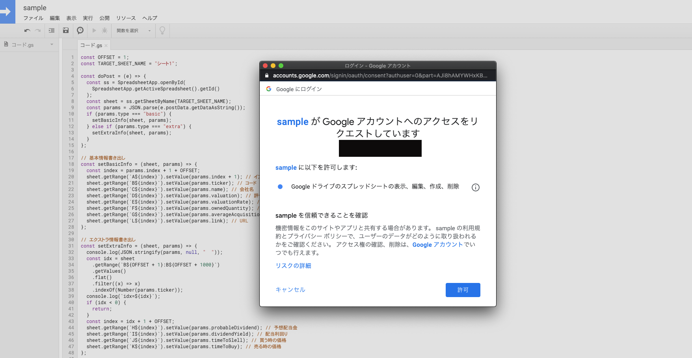

### 1.12:Current web app URL の値を控えておく

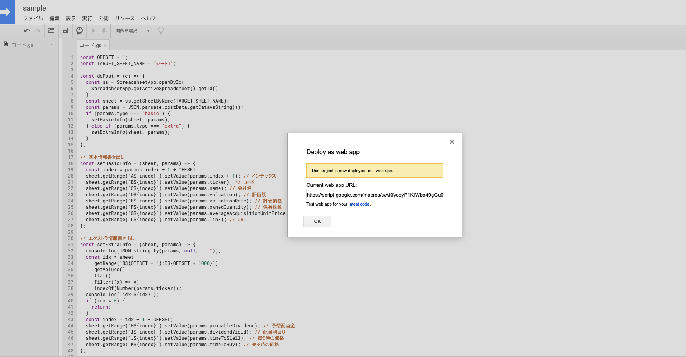

## 2. Tampermonkey の設定

### 2.1 Tampermonkey のインストール

[Tampermonkey へアクセス](https://chrome.google.com/webstore/detail/tampermonkey/dhdgffkkebhmkfjojejmpbldmpobfkfo?hl=ja)

### 2.2 「新規スクリプトを追加...」を選択する

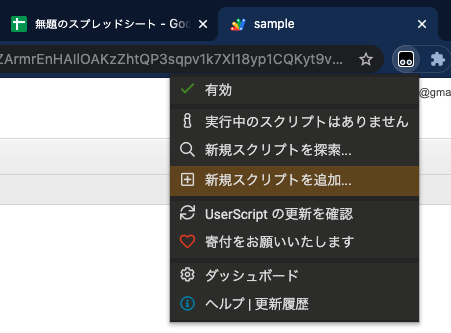

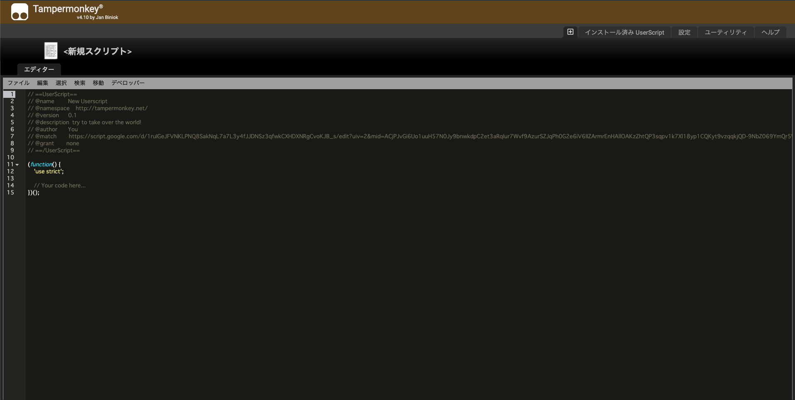

### 2.3 下記のコードを貼り付ける

[techreis/tampermonkey/app.js](https://github.com/techreis/neomobi-aggregater/blob/master/src/tampermonkey/app.js)

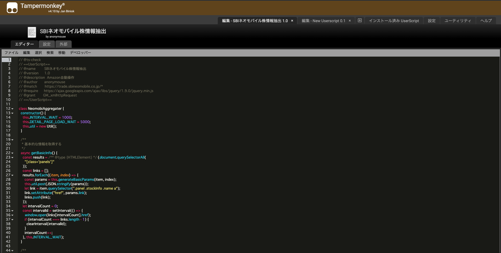

### 2.4 this.targetGASURL の値に先程控えておいた URL を貼り付ける

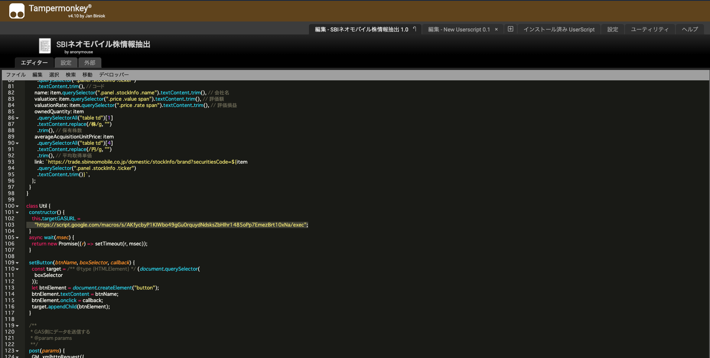

## 3.実行

### 3.1 ネオモバにログインする

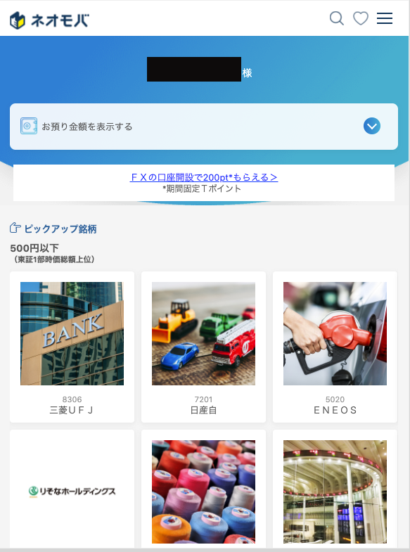

### 3.2 メニュー → 口座管理・注文一覧・入出金を選択する

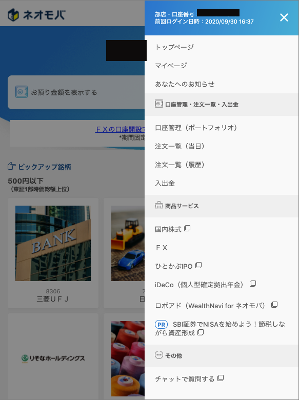

### 3.3 「スタート」ボタンを選択

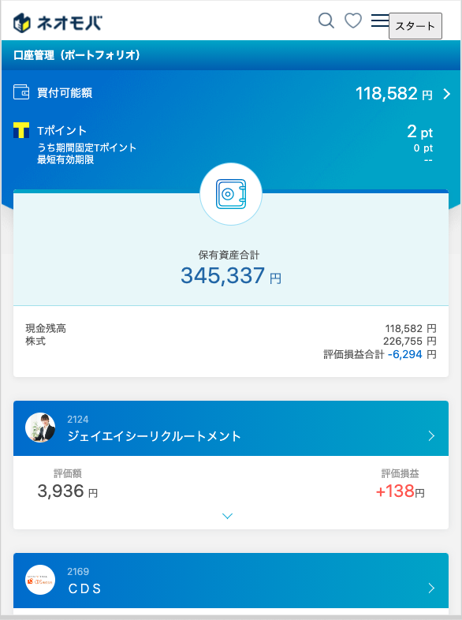
